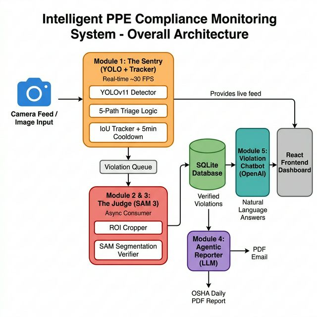
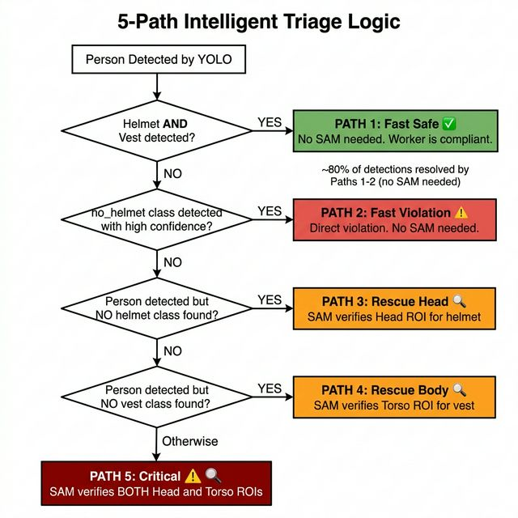
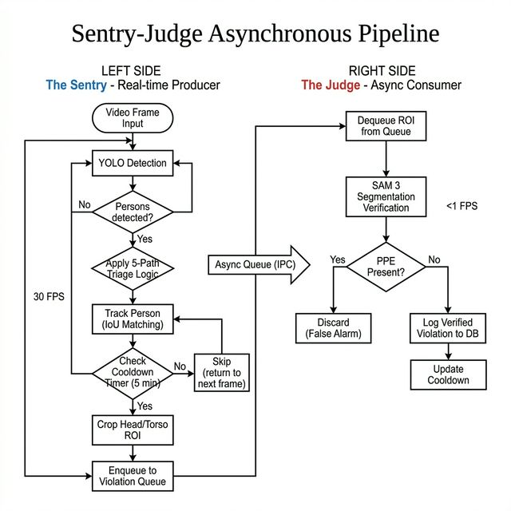
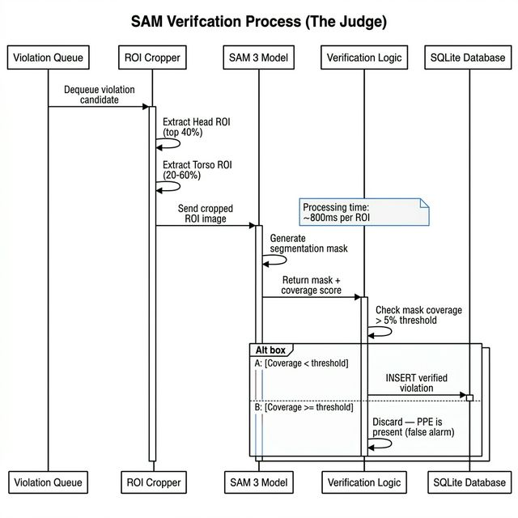
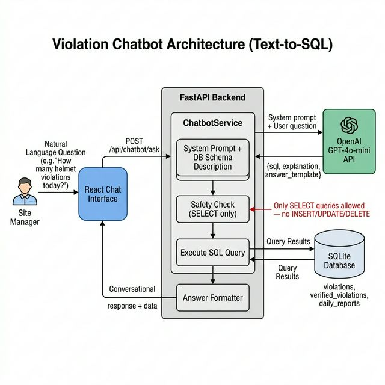

# Chapter 3: System Design and Architecture

## 3.1 Introduction

This chapter presents the architectural design of the Intelligent PPE Compliance Monitoring System. The system addresses a fundamental limitation in real-time safety monitoring: the tension between detection speed and verification accuracy. Standard single-stage object detectors such as YOLO [1][6][7] achieve real-time inference speeds but exhibit poor reliability when confirming the *absence* of protective equipment — a problem referred to throughout this work as the "absence detection paradox." Conversely, dense semantic segmentation models such as the Segment Anything Model (SAM) [8] deliver high verification accuracy but operate at less than one frame per second, making them unsuitable for direct integration into a live video pipeline.

To resolve this conflict, the system adopts a decoupled, asynchronous microservice architecture consisting of five functional modules: the Sentry, the Judge, the Violation Database, the Agentic Reporter, and the Violation Chatbot. Figure 3.1 illustrates the overall system architecture.

**Figure 3.1:** *Overall System Architecture showing the five-module pipeline: Sentry (YOLO detection), Judge (SAM verification), Violation Database, Agentic Reporter, and Violation Chatbot.*

## 3.2 Design Philosophy

Three core principles guided the architectural decisions:

**Principle 1 — Zero Alert Fatigue.** Construction site managers commonly disable automated safety alerts due to the volume of false positives generated by conventional systems [25]. This system produces a single, verified daily OSHA-format report rather than continuous real-time notifications, directly addressing the alert fatigue problem documented in industrial safety literature [26].

**Principle 2 — Asynchronous Decoupling.** The detection pipeline separates the fast producer (YOLO-based Sentry at ~30 FPS) from the slow consumer (SAM-based Judge at <1 FPS) through an internal message queue. This pattern, borrowed from microservice architectures [27], ensures that heavy verification never blocks the live video stream.

**Principle 3 — Economic Viability.** By limiting SAM invocations to only uncertain detections (approximately 20% of all cases), the system reduces computational overhead sufficiently to operate on a single mid-tier edge GPU such as the NVIDIA T4, rather than requiring enterprise-grade server clusters.

## 3.3 Use Case Analysis

To formalize the system's functional requirements, a UML Use Case Diagram was developed. Figure 3.2 identifies three primary actors and their interactions with the system:

- **Site Manager** — views the dashboard, queries the chatbot, reviews violation history, and receives daily OSHA reports.
- **Surveillance Camera** — provides the live video feed consumed by the Sentry module.
- **System (automated)** — performs YOLO detection, SAM verification, violation logging, and scheduled report generation.

**Figure 3.2:** *UML Use Case Diagram showing the interactions between the Site Manager, Surveillance Camera, and the system's functional modules.*

## 3.4 Data Flow Design

The system's data flow is modeled at two levels of abstraction using Data Flow Diagrams (DFDs), following the Yourdon-DeMarco structured analysis notation.

### 3.4.1 Level 0 — Context Diagram

Figure 3.3 presents the context diagram (DFD Level 0), which shows the system as a single process with its external entities and data flows. The primary input is the video stream from the surveillance camera, and the primary outputs are the compliance reports delivered to the site manager and the violation records persisted to the database.

**Figure 3.3:** *Data Flow Diagram Level 0 (Context Diagram) showing external entities and the system boundary.*

### 3.4.2 Level 1 — Process Decomposition

Figure 3.4 decomposes the system into its five core processes: (1) Frame Detection (Sentry), (2) Violation Verification (Judge), (3) Violation Storage (Database), (4) Report Generation (Reporter), and (5) Natural Language Query (Chatbot). The diagram traces the complete data flow from raw video frames through detection, triage, verification, storage, and finally to report generation and chatbot queries.

**Figure 3.4:** *Data Flow Diagram Level 1 showing the five core processes, data stores, and inter-process data flows.*

## 3.5 The Sentry Module (Module 1)

The Sentry serves as the real-time front-end of the detection pipeline. It is responsible for three tasks: object detection, person tracking, and intelligent triage.

### 3.5.1 Object Detection

The Sentry employs a YOLO26m model [7] trained on a unified five-class schema: `helmet`, `vest`, `person`, `no-helmet`, and `no-vest`. The model operates at an input resolution of 640×640 pixels with a confidence threshold of 0.30. The YOLO architecture was selected for its single-stage inference efficiency, which consistently achieves real-time throughput on consumer-grade GPUs [5][6].

The detection output for each frame consists of a set of bounding boxes, each annotated with a class label and a confidence score. These bounding boxes are then grouped by spatial proximity: each detected `person` bounding box is associated with any overlapping PPE or violation-class bounding box if their IoU exceeds a threshold $\tau_{\text{assoc}}$:

$$
\text{associate}(p, d) = \begin{cases} \text{true} & \text{if } \text{IoU}(B_p, B_d) \geq \tau_{\text{assoc}} \\ \text{false} & \text{otherwise} \end{cases} \quad (\tau_{\text{assoc}} = 0.30) \tag{3.1}
$$

where $B_p$ is the bounding box of the detected person and $B_d$ is the bounding box of the detected PPE or violation class.

### 3.5.2 Person Tracking and Cooldown Logic

To prevent redundant processing of the same individual across consecutive frames, the Sentry incorporates a custom IoU-based tracker that assigns persistent identifiers to detected persons. Unlike general-purpose multi-object trackers such as ByteTrack [10] or BoT-SORT [11], which are optimized for pedestrian re-identification in surveillance scenarios, this tracker is specifically tuned for the construction site domain where workers remain relatively stationary within camera zones.

Each tracked person is subject to a cooldown timer of $T_c = 300$ seconds (5 minutes). Once a worker evaluated and forwarded to the Judge, the same individual will not be re-evaluated for the duration of the cooldown period. Formally, a person with identifier $i$ is eligible for evaluation only if:

$$
t_{\text{now}} - t_{\text{last\_eval}}(i) \geq T_c \quad \text{where } T_c = 300 \text{ s} \tag{3.2}
$$

This mechanism ensures that each worker is assessed at most once per 5-minute window, preventing duplicate violations being raised for the same sustained non-compliance event. The formal pseudocode for the cooldown deduplication mechanism is presented in **Algorithm 2** (see Algorithms appendix).

### 3.5.3 Five-Path Intelligent Triage

The central algorithmic contribution of the Sentry module is the five-path triage logic, which classifies each detected person into one of five decision paths based on the combination of detected classes. Figure 3.5 illustrates this decision tree.

**Figure 3.5:** *Five-Path Triage Decision Tree showing the routing logic for detected persons based on PPE class combinations. Paths 0–1 bypass SAM; Paths 2–4 invoke SAM on specific ROIs.*

The five paths are defined as follows:

**Path 0 — Fast Safe.** Both `helmet` and `vest` classes are detected with high confidence within the person bounding box. The worker is classified as compliant. No SAM verification is required.

**Path 1 — Fast Violation.** The `no-helmet` class is detected with high confidence. Since the YOLO model was explicitly trained on negative examples, this constitutes a direct violation. No SAM verification is required.

**Path 2 — Rescue Head.** A `person` is detected but neither `helmet` nor `no-helmet` appears in the detection output. The system cannot determine helmet status from the YOLO output alone. The head region of interest is cropped using the following bounding box extraction formula, where $(x_1, y_1, x_2, y_2)$ are the coordinates of the person bounding box:

$$
ROI_{\text{head}} = \left(x_1,\ y_1,\ x_2,\ y_1 + 0.4 \cdot (y_2 - y_1)\right) \tag{3.3}
$$

The cropped head ROI is forwarded to the Judge for SAM verification.

**Path 3 — Rescue Body.** Analogous to Path 2, but for vest detection. The torso ROI is defined as:

$$
ROI_{\text{torso}} = \left(x_1,\ y_1 + 0.2 \cdot h,\ x_2,\ y_1 + 0.6 \cdot h\right) \quad \text{where } h = y_2 - y_1 \tag{3.4}
$$

This region covers the upper-middle torso area where high-visibility vests are worn.

**Path 4 — Critical.** Neither helmet nor vest status can be determined from the YOLO output. Both ROI extractions (Equations 3.3 and 3.4) are applied and both regions forwarded to the Judge.

Table 3.2 provides a consolidated summary of all five decision paths.

**Table 3.2: Five-Path Triage Decision Summary**

| Path | Name | Condition | SAM Required? | ROI Region | Violation Type |
|:----:|------|-----------|:-------------:|------------|----------------|
| 0 | Fast Safe | helmet ✓ AND vest ✓ | No | — | None |
| 1 | Fast Violation | no-helmet ✓ OR no-vest ✓ | No | — | Direct violation |
| 2 | Rescue Head | vest ✓, helmet unknown | Yes | Head (top 40%) | no_helmet |
| 3 | Rescue Body | helmet ✓, vest unknown | Yes | Torso (20–60%) | no_vest |
| 4 | Critical | Both unknown | Yes | Head + Torso | both_missing |

Empirical analysis of the detection distribution indicates that approximately 80% of all detections are resolved through Paths 0 and 1, requiring no SAM invocation. This bypass rate is a key factor in the system's ability to operate within the computational budget of a single-GPU deployment.

The formal pseudocode for the triage decision logic is presented in **Algorithm 1**, and the ROI crop extraction procedure is detailed in **Algorithm 5** (see Algorithms appendix).

## 3.6 The Judge Module (Modules 2 and 3)

The Judge operates as an asynchronous consumer that processes violation candidates submitted by the Sentry through an internal queue. Its role is binary verification: given a cropped region of interest, determine whether the expected PPE item is present or absent.

### 3.6.1 Asynchronous Queue Architecture

The Sentry and Judge communicate through a thread-safe producer-consumer queue. When the Sentry identifies a detection requiring verification (Paths 2, 3, or 4), it crops the relevant ROI from the original frame, packages it with metadata (person ID, camera zone, timestamp, decision path), and enqueues it. The Judge dequeues items independently in a background thread, ensuring that the Sentry's frame processing loop is never blocked by SAM inference. Figure 3.6 illustrates the complete pipeline flow.

**Figure 3.6:** *Sentry-Judge Asynchronous Pipeline showing the producer-consumer queue architecture. The Sentry (producer) runs at ~51.9 FPS while the Judge (consumer) processes ROIs at ~2.9 ROIs/second without blocking.*

The formal pseudocode for the complete producer-consumer pipeline is presented in **Algorithm 3** (see Algorithms appendix).

### 3.6.2 SAM-Based Verification

The Judge employs the Segment Anything Model (SAM) [8] to perform dense semantic segmentation on the cropped ROI. Unlike the Sentry's bounding-box-level classification, SAM generates pixel-level segmentation masks, enabling precise determination of whether a helmet or vest is present within the region.

The verification process proceeds as follows:

1. The cropped ROI is passed to SAM without prompt points, generating an automatic segmentation mask $M$.
2. The mask coverage ratio $\rho$ is computed as the proportion of the ROI area occupied by the foreground mask:

$$
\rho = \frac{|M_{\text{fg}}|}{|ROI|} = \frac{\sum_{(x,y) \in ROI} \mathbb{1}[M(x,y) = 1]}{W_{ROI} \times H_{ROI}} \tag{3.5}
$$

3. The PPE item is classified as **absent** (violation confirmed) if $\rho < \tau_{\text{SAM}}$, otherwise **present** (false alarm discarded):

$$
\text{verdict} = \begin{cases} \text{VIOLATION} & \text{if } \rho < \tau_{\text{SAM}} \\ \text{COMPLIANT} & \text{if } \rho \geq \tau_{\text{SAM}} \end{cases} \quad (\tau_{\text{SAM}} = 0.05) \tag{3.6}
$$

Figure 3.7 presents the SAM verification process as a sequence diagram.

**Figure 3.7:** *SAM Verification Sequence Diagram showing the two-stage process: (1) person validation to reject false person detections, and (2) PPE-specific segmentation to confirm or deny the violation.*

The formal pseudocode for the SAM semantic verification logic is presented in **Algorithm 4** (see Algorithms appendix).

Confirmed violations are persisted to the SQLite database with full metadata including the Sentry confidence score, Judge confidence score, processing time, decision path, and a reference to the saved ROI image.

## 3.7 Database Design

The system employs SQLite as its persistence layer, chosen for its zero-configuration deployment characteristics and suitability for edge devices. Three primary tables store the system's operational data.

**Table 3.3: Database Schema Overview**

| Table | Purpose | Key Fields |
|-------|---------|------------|
| `violations` | Records all Sentry-detected violations | `violation_type`, `has_helmet`, `has_vest`, `decision_path`, `detection_confidence`, `sam_activated`, `occurrence_count`, `total_duration_minutes` |
| `verified_violations` | Records Judge-confirmed violations only | `person_id`, `camera_zone`, `judge_confirmed`, `judge_confidence`, `sentry_confidence` |
| `daily_reports` | Tracks generated PDF reports | `report_date`, `total_violations`, `compliance_rate`, `email_sent` |

The `violations` table implements session-based tracking: rather than inserting a new row each time a worker is re-detected, the existing row is updated with an incremented `occurrence_count` and extended `total_duration_minutes`. This design ensures that the daily report presents one entry per violation event rather than hundreds of duplicate rows for the same worker.

## 3.8 The Agentic Reporter (Module 4)

The Reporter module operates on a scheduled trigger, executing once daily at a configured time (default: 23:59). It queries the `verified_violations` table for all confirmed violations recorded during the current day and generates a structured PDF report in OSHA-compliant format.

The report generation pipeline employs a large language model (LLM) agent [22] to transform raw database records into human-readable narrative summaries. The LLM receives the violation data as structured input (JSON format) and produces formatted text sections including:

- Executive summary with total violation count and compliance rate.
- Per-violation breakdown with timestamps, violation types, and durations.
- Trend analysis comparing the current day against the 7-day rolling average.

The generated PDF is stored locally and optionally distributed to configured manager email addresses via SMTP.

## 3.9 The Violation Chatbot (Module 5)

To provide on-demand access to violation data, the system includes a natural language query interface implemented as a chatbot. Site managers can pose questions in plain language (e.g., "How many helmet violations occurred this week?"), which are translated into SQL queries and executed against the database.

### 3.9.1 Text-to-SQL Architecture

The chatbot employs OpenAI's GPT-4o-mini model [22] in a text-to-SQL configuration inspired by recent advances in LLM-based database interfaces [23][24]. The architecture is illustrated in Figure 3.8.

**Figure 3.8:** *Chatbot Text-to-SQL Architecture showing the query pipeline from natural language input through LLM-based SQL generation, safety validation, database execution, and conversational response formatting.*

The query pipeline operates as follows:

1. The user submits a natural language question through the React frontend.
2. The question is forwarded to the FastAPI backend, which constructs a prompt containing the database schema description and the user's question.
3. The prompt is sent to the OpenAI API, which returns a JSON response containing the generated SQL query, a brief explanation, and an answer template.
4. A safety layer verifies that the generated query is a SELECT statement. INSERT, UPDATE, DELETE, and DROP operations are rejected.
5. The validated query is executed against the SQLite database.
6. Results are formatted into a conversational response and returned to the user.

### 3.9.2 Security Considerations

The chatbot enforces a strict read-only policy at the application layer. All generated SQL statements are validated against a whitelist of permitted operations before execution. This prevents potential injection attacks or unintended data modification through adversarial prompt engineering.

## 3.10 Frontend Dashboard

The user interface is implemented as a single-page React application [28] with four primary views:

1. **Image Detection** — Upload a single image for PPE analysis with annotated results.
2. **Video Detection** — Process video files with frame-by-frame analysis and aggregate statistics.
3. **Violation History** — Tabular view of all recorded violations with filtering and pagination.
4. **AI Chatbot** — Conversational interface for querying violation data.

The frontend communicates with the backend exclusively through RESTful API endpoints served by FastAPI [27], with CORS middleware configured for development and production environments.

## 3.11 Chapter Summary

This chapter presented the architectural design of the Intelligent PPE Compliance Monitoring System, beginning with the use case analysis (Figure 3.2) and data flow decomposition (Figures 3.3–3.4) that formalize the system's functional requirements. The key design contribution is the decoupled Sentry-Judge pipeline (Figure 3.6), which resolves the fundamental tension between real-time detection speed (YOLO26m) and verification accuracy (SAM) by introducing an asynchronous queue between the two stages. The five-path triage mechanism (Figure 3.5, Table 3.2) routes approximately 80% of detections through fast decision paths that bypass SAM entirely. The formal definitions of the IoU association rule (Eq. 3.1), cooldown eligibility (Eq. 3.2), ROI extraction bounds (Eqs. 3.3–3.4), and SAM coverage ratio threshold (Eqs. 3.5–3.6) together constitute the complete algorithmic specification of the triage system, with detailed pseudocode provided in Algorithms 1–5 (see Algorithms appendix). The system is complemented by a scheduled LLM-based reporter for daily compliance summaries and a text-to-SQL chatbot for on-demand violation queries.
