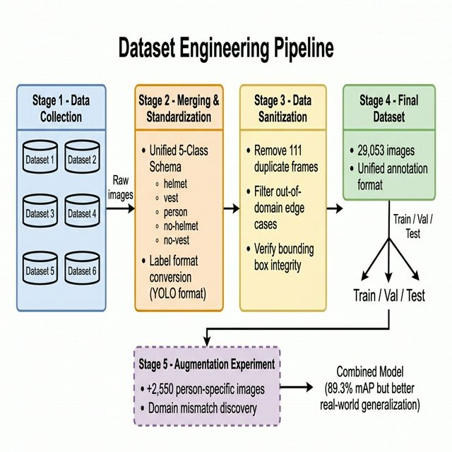
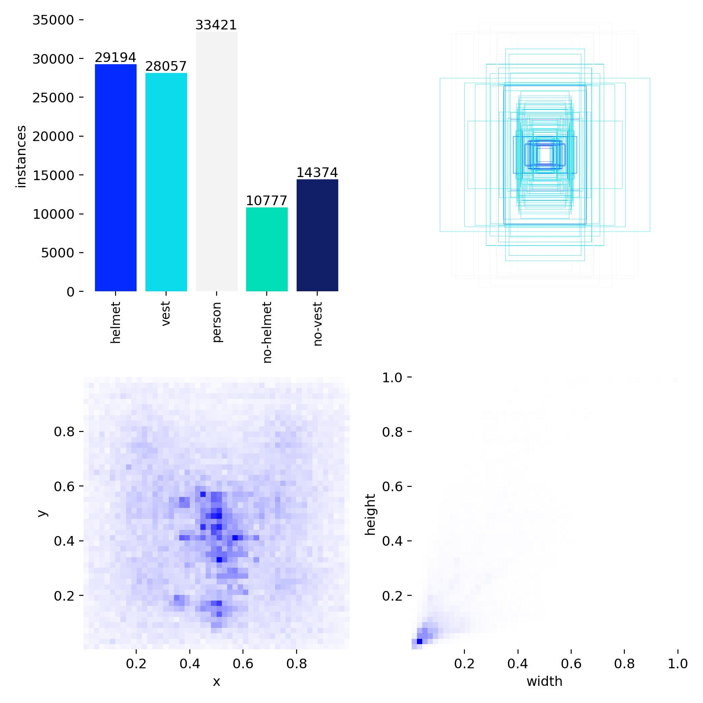
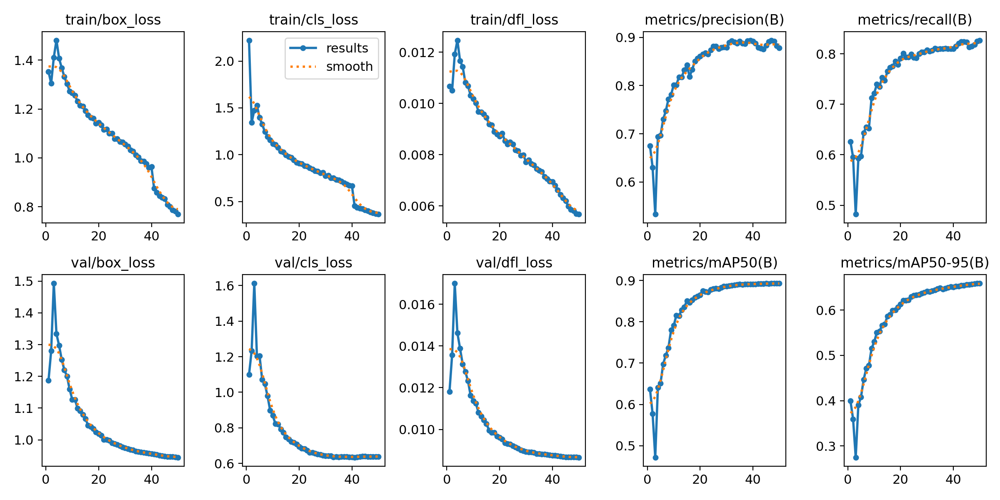
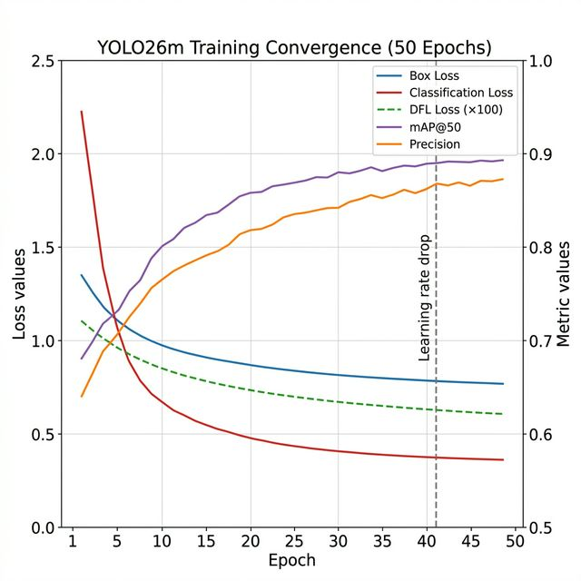

# Chapter 4: Implementation

## 4.1 Introduction

This chapter describes the implementation of the Intelligent PPE Compliance Monitoring System. It covers dataset construction, model training, backend service development, frontend implementation, and the chatbot integration. Where relevant, specific configuration values and code-level decisions are documented to support reproducibility.

## 4.2 Dataset Engineering

### 4.2.1 Source Datasets

The unified training dataset was assembled from six publicly available construction site PPE datasets sourced from Roboflow Universe [29][30][31][32][33][34]. These datasets were selected based on three criteria: domain relevance (construction site imagery), annotation quality (consistent bounding box coverage), and class diversity (variation in lighting, worker poses, and camera angles).

A seventh dataset [35] — a construction worker segmentation dataset — was converted to a detection-format person-class dataset to supplement training data for the `person` base class. This conversion involved extracting segmentation contours and computing the minimum enclosing axis-aligned bounding boxes.

Table 4.1 summarizes the composition of each source dataset.

**Table 4.1: Source Dataset Composition**

| # | Dataset Source | Primary Classes | Images |
|---|----------------|-----------------|--------|
| 1 | Construction PPE Detection [29] | helmet, vest, person | ~4,800 |
| 2 | Construction PPE Detection OIYSP [30] | helmet, vest, no-helmet | ~3,200 |
| 3 | Construction Worker PPE [31] | helmet, vest, person | ~5,100 |
| 4 | Construction PPE QOFI4 [32] | helmet, no-helmet, vest | ~4,200 |
| 5 | Safety AKUCZ [33] | helmet, vest, person | ~3,900 |
| 6 | Construction RINEU [34] | helmet, vest | ~5,300 |
| 7 | Construction Person Detection [35] | person (converted from segmentation) | ~2,553 |
| | **Total (after deduplication)** | | **~29,053** |

### 4.2.2 Schema Standardization

Each source dataset employed differing class naming conventions (e.g., `hardhat` vs. `helmet`, `safety-vest` vs. `vest`, `no-hardhat` vs. `bare-head`). A standardization script mapped all source annotations to the following five-class unified schema:

**Table 4.2: Unified Five-Class Schema**

| Class ID | Class Name | Description |
|----------|-----------|-------------|
| 0 | `helmet` | Hard hat present on worker's head |
| 1 | `vest` | High-visibility vest present on worker's torso |
| 2 | `person` | Worker body (base detection class) |
| 3 | `no-helmet` | Head region without a hard hat |
| 4 | `no-vest` | Torso region without a vest |

### 4.2.3 Data Sanitization

Following merging, the combined dataset underwent quality filtering:

- **Duplicate removal:** 111 near-duplicate images (detected via perceptual hashing) were removed to prevent evaluation data leakage into training.
- **Out-of-domain filtering:** Images depicting non-construction environments (indoor office settings, stock photo backgrounds) were manually reviewed and excluded to prevent domain mismatch artifacts.
- **Bounding box validation:** Annotations with degenerate bounding boxes (zero area, coordinates exceeding image dimensions) were corrected or discarded.

The final dataset of 29,053 images was divided into training (80%), validation (10%), and test (10%) splits with stratified sampling to maintain class distribution across splits.

Figure 4.1 illustrates the end-to-end dataset engineering pipeline from source ingestion to final split generation. Figure 4.2 shows the resulting class label distribution across the unified dataset.

**Figure 4.1:** *Dataset Engineering Pipeline showing the six-stage process: source collection, format conversion, schema standardization, deduplication, quality filtering, and stratified train/val/test splitting.*

**Figure 4.2:** *Class Label Distribution across the unified 29,053-image dataset, showing the relative frequency of helmet, vest, person, no-helmet, and no-vest annotations.*

### 4.2.4 Augmentation Experiments

To assess the impact of data augmentation, an additional 2,550 person-specific images from the construction person detection dataset [35] were incorporated into the training set. This expanded dataset was used to train the "combined model," as described in Chapter 5. The baseline model was trained exclusively on the first six datasets.

## 4.3 Model Training

### 4.3.1 Training Configuration

The YOLO26m model [7] was trained using the Ultralytics training pipeline. Training was performed on a GPU instance. Table 4.3 summarizes the key training hyperparameters.

**Table 4.3: YOLO26m Training Configuration**

| Parameter | Value |
|-----------|-------|
| Model architecture | YOLO26m |
| Input image resolution | 640 × 640 pixels |
| Epochs | 50 |
| Batch size | 16 |
| Optimizer | AdamW |
| Initial learning rate | 0.01 |
| Learning rate scheduler | Cosine annealing with warmup |
| Confidence threshold | 0.30 |
| IoU threshold (NMS) | 0.45 |
| Number of classes | 5 |

### 4.3.2 Training Progress

Figures 4.3 and 4.4 present the training progression over 50 epochs, showing all recorded metrics and the loss/mAP convergence behavior respectively.

**Figure 4.3:** *Training Metric Curves (All Metrics) recorded over 50 epochs, including box loss, classification loss, DFL loss, precision, recall, mAP@50, and mAP@50-95.*

**Figure 4.4:** *Loss and mAP Convergence over 50 epochs. The classification loss decreases from 2.22 (epoch 1) to 0.36 (epoch 50), while mAP@50 improves from 0.637 to 0.893, demonstrating stable convergence without overfitting.*

Training curves show consistent improvement across all metrics over 50 epochs. The classification loss, which started at 2.22 in epoch 1, decreased to 0.36 by epoch 50, indicating strong model convergence. The mAP@50 metric improved from 0.637 (epoch 1) to 0.893 (epoch 50), demonstrating stable learning without overfitting.

The total training loss $\mathcal{L}_{\text{total}}$ is defined as a weighted combination of three component losses:

$$
\mathcal{L}_{\text{total}} = \lambda_{\text{box}} \cdot \mathcal{L}_{\text{box}} + \lambda_{\text{cls}} \cdot \mathcal{L}_{\text{cls}} + \lambda_{\text{dfl}} \cdot \mathcal{L}_{\text{dfl}} \tag{4.1}
$$

The bounding box regression employs Distribution Focal Loss (DFL) [6], which models the predicted box coordinates as a discrete probability distribution over a fixed set of regression values. DFL outperforms traditional L1/L2 regression losses by capturing the ambiguity in bounding box ground truth labels:

$$
\mathcal{L}_{\text{dfl}}(S_i) = -\left( (y_{i+1} - y) \log S_i + (y - y_i) \log S_{i+1} \right) \tag{4.2}
$$

where $y$ is the target box coordinate, $y_i$ and $y_{i+1}$ are the nearest discrete regression values, and $S_i$ is the predicted probability for value $y_i$.

The classification loss uses Binary Cross-Entropy (BCE) computed independently for each of the $C = 5$ classes:

$$
\mathcal{L}_{\text{cls}} = -\frac{1}{N} \sum_{n=1}^{N} \sum_{c=1}^{C} \left[ y_{n,c} \log \hat{y}_{n,c} + (1 - y_{n,c}) \log (1 - \hat{y}_{n,c}) \right] \tag{4.3}
$$

where $y_{n,c} \in \{0, 1\}$ is the ground truth label and $\hat{y}_{n,c} \in (0, 1)$ is the predicted class probability for anchor $n$ and class $c$.

A notable inflection point occurs at epoch 41, where the classification loss drops sharply from 0.6660 to 0.4537 — a 31.8% single-epoch reduction. This corresponds to the cosine annealing scheduler reaching its minimum learning rate, after which the optimizer makes smaller, more precise parameter updates.

## 4.4 Backend Implementation

The backend is implemented in Python using the FastAPI framework [27]. The service exposes a RESTful API consumed by both the React frontend and external monitoring clients.

### 4.4.1 Service Architecture

The backend consists of the following service modules:

**Table 4.4: Backend Service Module Structure**

| Module | File | Responsibility |
|--------|------|---------------|
| YOLO Detector | `yolo_detector.py` | Model loading and frame inference |
| SAM Verifier | `sam_verifier.py` | Synchronous SAM inference |
| Async SAM Verifier | `async_sam_verifier.py` | Queue-based async SAM consumer |
| Hybrid Detector | `hybrid_detector.py` | 5-path triage orchestration |
| Sentry | `sentry.py` | Real-time detection loop |
| Judge | `judge.py` | Verified violation logging |
| Violation Tracker | `violation_tracker.py` | Cooldown and IoU tracking |
| Report Generator | `report_generator.py` | OSHA PDF generation |
| Chatbot Service | `chatbot_service.py` | Text-to-SQL via OpenAI |
| Email Service | `email_service.py` | SMTP report distribution |
| Storage Service | `storage_service.py` | ROI image persistence |

### 4.4.2 Class Architecture

Figure 4.5 presents the UML class diagram for the backend service layer, showing the key classes, their attributes, methods, and inter-class relationships. The `HybridDetector` class serves as the central orchestrator, coordinating between the `YOLODetector`, `SAMVerifier`, and `ViolationTracker` classes to implement the five-path triage logic described in Section 3.5.3.

**Figure 4.5:** *UML Class Diagram showing the backend service architecture. Key classes include HybridDetector (triage orchestrator), YOLODetector (YOLO inference), SAMVerifier (SAM verification), ViolationTracker (cooldown logic), ReportGenerator (PDF generation), and ChatbotService (text-to-SQL).*

### 4.4.3 Five-Path Triage Implementation

The triage logic is implemented in `hybrid_detector.py` as the `HybridDetector` class. The `_process_person()` method evaluates each detected person bounding box against the five decision paths. For each person, the detector queries the YOLO output for overlapping PPE-class bounding boxes using IoU filtering. The decision path is determined by the presence or absence of the `helmet`, `vest`, `no-helmet`, and `no-vest` classes within the person's bounding box region. The algorithm-level specification is provided in **Algorithm 1** (see Algorithms appendix).

### 4.4.4 Database Integration

The system uses SQLAlchemy 2.0 as the ORM layer, with SQLite as the default persistence backend. Database sessions are managed through FastAPI's dependency injection system, ensuring proper session lifecycle management per request. All database models are defined in `database/models.py`, and the schema is created at application startup via `Base.metadata.create_all()`.

### 4.4.5 Configuration Management

All runtime parameters are managed through Pydantic Settings, loaded from a `.env` file at startup. This approach provides type-safe configuration with automatic validation of environment variables. Key configurable parameters include the YOLO model path, SAM model path, violation cooldown duration, IoU tracking threshold, SMTP credentials, and the OpenAI API key.

## 4.5 Frontend Implementation

The frontend is implemented as a React 18 [28] single-page application built with Vite 5. It communicates with the backend via Axios HTTP requests.

### 4.5.1 Component Structure

The application consists of eight primary components:

**Table 4.5: Frontend Component Structure**

| Component | Responsibility |
|-----------|---------------|
| `Header` | Navigation bar and settings trigger |
| `UploadZone` | Drag-and-drop image upload |
| `DetectionCanvas` | Annotated image display |
| `StatsPanel` | Detection statistics summary |
| `ViolationCard` | Per-person violation detail card |
| `HistoryTable` | Paginated violation history with filters |
| `VideoUpload` | Video file processing interface |
| `ChatBot` | Conversational violation query interface |

### 4.5.2 Application Interface

Figures 4.6 through 4.11 present screenshots of the implemented frontend application, demonstrating the system's end-to-end user experience across all primary views.

**Figure 4.6:** *Dashboard Upload Interface — the landing page providing drag-and-drop image upload functionality with a clean, modern UI design.*

**Figure 4.7:** *Detection Result View — showing annotated bounding boxes overlaid on the uploaded image with per-detection class labels, confidence scores, and a summary statistics panel.*

**Figure 4.8:** *Video Processing Interface — showing the video upload, frame-by-frame analysis controls, and real-time detection statistics accumulated across processed frames.*

**Figure 4.9:** *Violation History View — displaying a paginated table of all recorded violations with filtering by date, violation type, and decision path, along with saved ROI evidence images.*

**Figure 4.10:** *Settings Panel — allowing site administrators to configure runtime parameters including confidence thresholds, cooldown durations, model selection, and email notification preferences.*

### 4.5.3 Chatbot Interface

The `ChatBot` component provides a full-screen chat interface with suggested quick-questions (e.g., "How many violations today?"), a typing indicator, and an expandable SQL query viewer that shows the generated SQL for each response. This transparency feature allows technically proficient users to verify the accuracy of the query before acting on the result. Figure 4.11 illustrates the chatbot interface.

**Figure 4.11:** *AI Chatbot Interface — showing the conversational violation query interface with suggested quick-questions, the generated SQL query viewer, and natural language responses.*

## 4.6 Chatbot Service Implementation

The chatbot service (`chatbot_service.py`) implements the text-to-SQL pipeline described in Section 3.9. The OpenAI API is invoked with `response_format={"type": "json_object"}`, enforcing structured JSON output that contains the generated SQL, an explanation, and an answer template. The service is initialized lazily on first use, and the OpenAI client is only instantiated when a valid `OPENAI_API_KEY` is present in the environment — allowing the rest of the system to function without the chatbot when the key is not configured.

## 4.7 Chapter Summary

This chapter described the complete implementation of the Intelligent PPE Compliance Monitoring System. The dataset was assembled from seven source datasets totaling 29,053 images after sanitization (Figure 4.1), standardized to a five-class schema (Table 4.2), and used to train a YOLO26m model for 50 epochs (Figures 4.3–4.4). The training objective (Eq. 4.1) combines DFL bounding box regression (Eq. 4.2) and multi-class Binary Cross-Entropy (Eq. 4.3), optimized using AdamW with cosine annealing. The backend provides a modular Python service architecture built on FastAPI (Table 4.4), with its class relationships formalized in the UML class diagram (Figure 4.5). The frontend provides a React-based dashboard with image detection (Figure 4.7), video processing (Figure 4.8), violation history (Figure 4.9), settings (Figure 4.10), and chatbot interfaces (Figure 4.11).
