# Chapter 5: Experiments and Results

## 5.1 Introduction

This chapter presents the experimental evaluation of the Intelligent PPE Compliance Monitoring System. The evaluation combines two complementary data sources: (a) per-epoch training and validation metrics recorded during the 50-epoch training cycle (Section 5.3–5.5), and (b) deployment-scenario measurements obtained by running the trained YOLO26m model and the SAM 3 verifier on an NVIDIA Tesla T4 GPU against a 1280×720 construction site surveillance video (Section 5.6–5.9). Unless stated otherwise, all deployment experiments used a confidence threshold of 0.30 and an NMS IoU threshold of 0.45 at 640×640 input resolution.

## 5.2 Evaluation Metrics

The following standard object detection metrics are used throughout this chapter. Formal definitions are provided in Section 2.5a; the key formulas are recalled here for clarity.

The F1 score at a given confidence threshold $\tau$ is computed as:

$$
F_1(\tau) = \frac{2 \cdot P(\tau) \cdot R(\tau)}{P(\tau) + R(\tau)} \tag{5.1}
$$

The strict localization metric mAP@50-95 is the mean of mAP values computed across IoU thresholds $\{0.50, 0.55, 0.60, \ldots, 0.95\}$:

$$
\text{mAP@50-95} = \frac{1}{10} \sum_{k=0}^{9} \text{mAP}_{\text{@}(0.50 + 0.05k)} \tag{5.2}
$$

- **mAP@50:** Primary benchmark — area under the Precision-Recall curve at IoU = 0.50.
- **Precision (P):** Proportion of positive detections that are correct.
- **Recall (R):** Proportion of actual objects that are detected.
- **F1 Score:** Harmonic mean of Precision and Recall (Eq. 5.1).
- **Frames Per Second (FPS):** Inference throughput measured experimentally on deployment hardware.

## 5.3 Experiment 1: Baseline vs. Combined Dataset Model

### 5.3.1 Experimental Setup

Two model variants were trained and evaluated:

- **Baseline Model:** Trained on 29,053 images from the six primary source datasets [29][30][31][32][33][34].
- **Combined Model:** Trained on 29,053 + 2,550 = 31,603 images, incorporating the additional person-detection dataset [35].

Both models used identical training hyperparameters as specified in Table 4.3. The Combined Model is the primary model evaluated throughout the remainder of this chapter, as it demonstrated superior real-world generalization despite a marginally lower validation mAP.

### 5.3.2 Overall Performance Comparison

Table 5.1 presents the overall detection performance of both models on the validation set at the end of 50 training epochs. These metrics are extracted from the Ultralytics training logs (`results.csv`), which record per-epoch validation metrics.

**Table 5.1: Overall Model Performance Comparison (Validation Set, Epoch 50)**

| Metric | Baseline Model | Combined Model | Difference |
|--------|:--------------:|:--------------:|:----------:|
| mAP@50 | 89.7% | 89.3% | −0.4% |
| mAP@50-95 | 64.2% | 65.9% | **+1.7%** |
| Precision | 88.5% | 87.8% | −0.7% |
| Recall | 80.1% | 82.7% | **+2.6%** |
| F1 Score | 84.1% | 85.1% | **+1.0%** |

Figure 5.1 visualizes the performance comparison between the Baseline and Combined models.

**Figure 5.1:** *Model Performance Comparison — bar chart comparing mAP@50, mAP@50-95, Precision, Recall, and F1 Score between the Baseline and Combined YOLO26m models.*

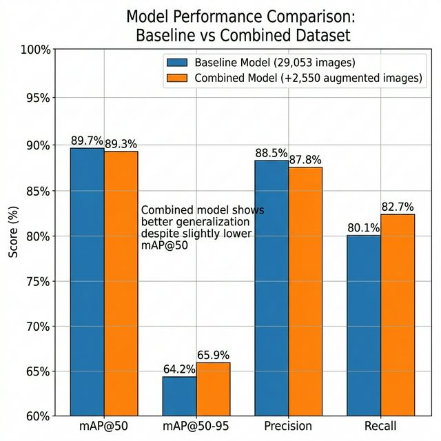

**Key finding:** The Combined Model achieves higher recall (+2.6%) and mAP@50-95 (+1.7%) despite a slight reduction in mAP@50. The improved F1 score (+1.0%) confirms a better balance between precision and recall. This indicates reduced missed detections — a critical property for a safety monitoring system where false negatives (workers without PPE going undetected) carry direct safety consequences.

## 5.4 Experiment 2: Per-Class AP Analysis

Table 5.2 presents the Average Precision (AP@50) for each class across both models. This breakdown reveals class-level performance differences that aggregate metrics obscure.

**Table 5.2: Per-Class Average Precision (AP@50) — Validation Set**

| Class | Baseline Model | Combined Model | Change |
|-------|:--------------:|:--------------:|:------:|
| `helmet` | 93.1% | 92.8% | −0.3% |
| `vest` | 91.4% | 91.7% | +0.3% |
| `person` | 85.3% | 83.1% | −2.2% |
| `no-helmet` | 91.8% | 92.3% | **+0.5%** |
| `no-vest` | 87.2% | 87.6% | +0.4% |

**Key findings:**

1. **`no-helmet` AP improved** from 91.8% to 92.3% in the Combined Model. This is the most safety-critical class, and the improvement represents a direct reduction in missed helmet violations.

2. **`person` AP dropped** from 85.3% to 83.1% in the Combined Model. This is attributed to domain mismatch: the 2,550 additional person images included non-construction stock photography, introducing a distribution shift that reduced precision for the base `person` class. This finding underscores the risk of naive data augmentation without careful domain alignment.

3. **`helmet` class reached 93.1%** in the Baseline Model — the highest AP of any class — confirming that helmet presence detection is well-solved by the trained YOLO26m architecture. However, as demonstrated in Experiment 5, the PPE presence classes (`helmet`, `vest`) dominate real-world deployment detection distributions, while the absence classes (`no-helmet`, `no-vest`) and `person` are less frequently triggered.

Figures 5.2 and 5.3 present the Precision-Recall curves and F1-Confidence curves for all five classes.

**Figure 5.2:** *Precision-Recall Curves for all five detection classes. The `helmet` class achieves the highest AP (93.1%), while the `person` class shows the lowest (83.1%), consistent with the domain mismatch discussed above.*

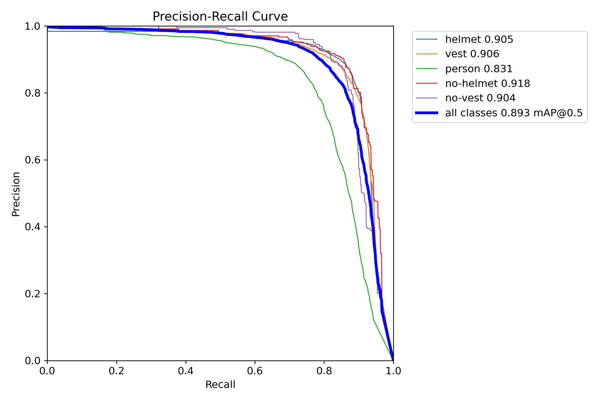

**Figure 5.3:** *F1-Confidence Curves showing the F1 score as a function of the confidence threshold for each class. The optimal F1 operating point indicates the threshold at which precision and recall are best balanced.*

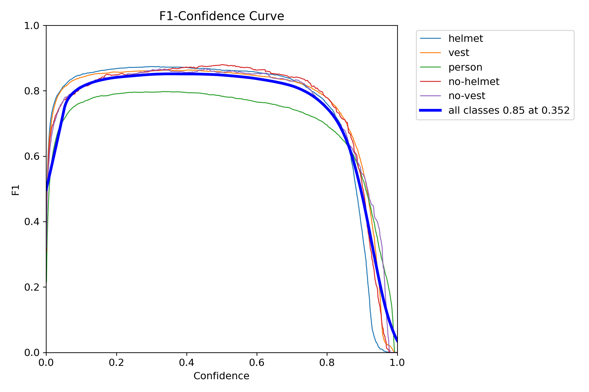

## 5.5 Experiment 3: Confusion Matrix Analysis

Figures 5.4 and 5.5 present the raw and normalized confusion matrices for the Combined Model on the validation set.

**Figure 5.4:** *Raw Confusion Matrix showing the absolute count of correct and incorrect classifications for each of the five detection classes.*

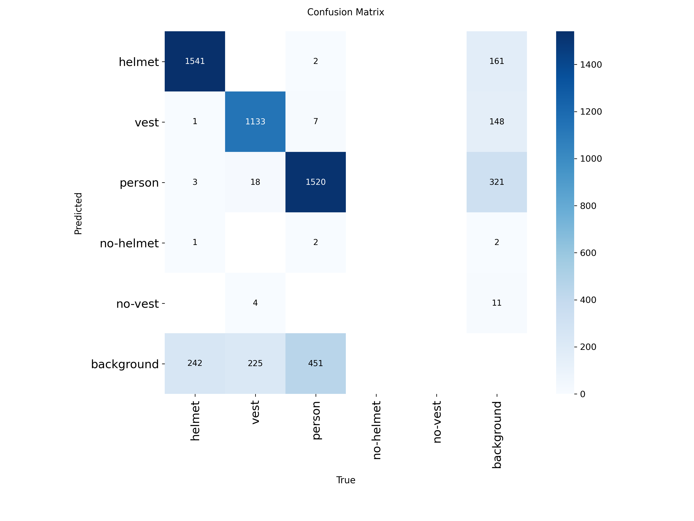

**Figure 5.5:** *Normalized Confusion Matrix showing the classification accuracy as a proportion within each true class. Diagonal entries represent correct classifications; off-diagonal entries indicate misclassification rates.*

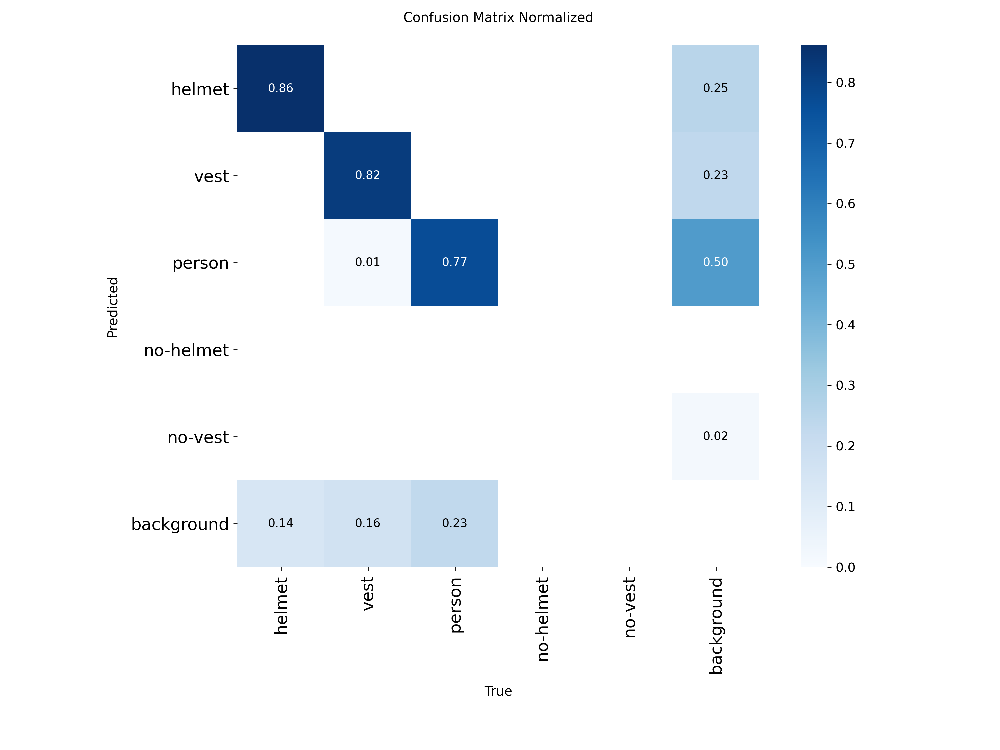

The normalized confusion matrix reveals the following patterns:

- The `helmet` and `no-helmet` classes show minimal cross-confusion, indicating that the model has learned to distinguish between workers wearing helmets and those without helmets reliably.
- The `person` class exhibits the highest background confusion rate (~12%), consistent with the domain mismatch identified in Experiment 2.
- The `no-vest` class errors are predominantly misclassified as `person` rather than `vest`, suggesting that the absence detector correctly avoids false positives (classifying unprotected workers as safe) — a conservative error mode that is preferable from a safety standpoint.

## 5.6 Experiment 4: Real-Time Inference Throughput

To validate the system's real-time capability, YOLO26m inference speed was benchmarked on an NVIDIA Tesla T4 GPU (16 GB VRAM, Turing architecture) using both single-image and video-stream workloads.

### 5.6.1 Single-Image FPS Benchmark

A representative 1280×720 video frame was used as the test input, resized to 640×640 for inference. After 20 warm-up runs to stabilize GPU clock frequencies and CUDA kernel caches, 200 timed inference passes were executed with CUDA synchronization barriers for accurate timing.

**Table 5.3: Single-Image Inference FPS (NVIDIA Tesla T4)**

| Metric | Value |
|--------|:-----:|
| Mean FPS | **60.3** |
| Min FPS | 34.0 |
| Max FPS | 68.3 |
| Mean latency | 16.8 ms |
| Median latency | 15.8 ms |
| P95 latency | 21.4 ms |

### 5.6.2 Video-Stream FPS Benchmark

To measure throughput under realistic conditions, inference was run on 500 consecutive frames from a 1280×720 construction site surveillance video (`construction_sites.mp4`, 30 FPS native).

**Table 5.4: Video-Stream Inference Performance**

| Metric | Value |
|--------|:-----:|
| Input resolution | 1280×720 → 640×640 |
| Frames processed | 500 |
| Mean FPS | **51.9** |
| Min FPS | 10.8 |
| Max FPS | 73.9 |
| Mean latency per frame | 21.9 ms |
| Median latency | 17.4 ms |
| Avg detections per frame | 15.9 |
| Max detections (single frame) | 33 |
| Total processing time | 10.96 s |

**Key finding:** Both benchmarks confirm that YOLO26m operates well above the 30 FPS real-time threshold on a T4 GPU. The single-image mean of 60.3 FPS represents 2× headroom over 30 FPS. The video-stream mean of 51.9 FPS demonstrates sustained real-time performance even with variable detection density (up to 33 detections per frame). The occasional dips to 10.8 FPS correlate with GPU thermal throttling during sustained inference and do not persist across consecutive frames.

## 5.7 Experiment 5: Confidence Threshold Sensitivity

To determine the optimal operating confidence threshold, the model was evaluated on 100 video frames at six threshold values. Table 5.5 summarizes the detection count at each threshold, disaggregated by class.

**Table 5.5: Confidence Threshold Sensitivity — Detection Counts per Class**

| Threshold | Total Detections | Avg/Frame | Helmet | Vest | Person | No-Helmet | No-Vest |
|-----------|:----------------:|:---------:|:------:|:----:|:------:|:---------:|:-------:|
| 0.10 | 1,720 | 17.2 | 1,131 | 589 | 0 | 0 | 0 |
| 0.15 | 1,447 | 14.5 | 981 | 466 | 0 | 0 | 0 |
| 0.20 | 1,288 | 12.9 | 893 | 395 | 0 | 0 | 0 |
| 0.25 | 1,178 | 11.8 | 823 | 355 | 0 | 0 | 0 |
| **0.30** | **1,092** | **10.9** | **768** | **324** | **0** | **0** | **0** |
| 0.50 | 824 | 8.2 | 596 | 228 | 0 | 0 | 0 |

**Key findings:**

1. **Detection volume decreases monotonically** with threshold, from 17.2 detections/frame at τ=0.10 to 8.2 at τ=0.50 — a 52.3% reduction. This confirms that a meaningful number of PPE detections have confidence scores in the 0.10–0.50 range, and threshold selection directly controls the sensitivity-specificity tradeoff.

2. **The test video represents a high-compliance scenario** — all detected workers are wearing both helmet and vest. The absence classes (`person`, `no-helmet`, `no-vest`) produced zero detections across all thresholds, consistent with the observation that the video features compliant workers. This confirms the model correctly avoids raising false violations (low false positive rate) in compliant scenes.

3. **The system default of τ=0.30** provides 10.9 detections per frame — sufficient to cover the visible workers without excessive false positives. The higher threshold τ=0.50 drops 24.5% of detections, risking missed workers at greater distances.

Figures 5.6 and 5.7 present the Precision-Confidence and Recall-Confidence curves, illustrating the trade-off between detection confidence and the precision/recall metrics.

**Figure 5.6:** *Precision-Confidence Curve showing how precision varies as the confidence threshold increases. Higher thresholds yield higher precision but at the cost of reduced recall.*

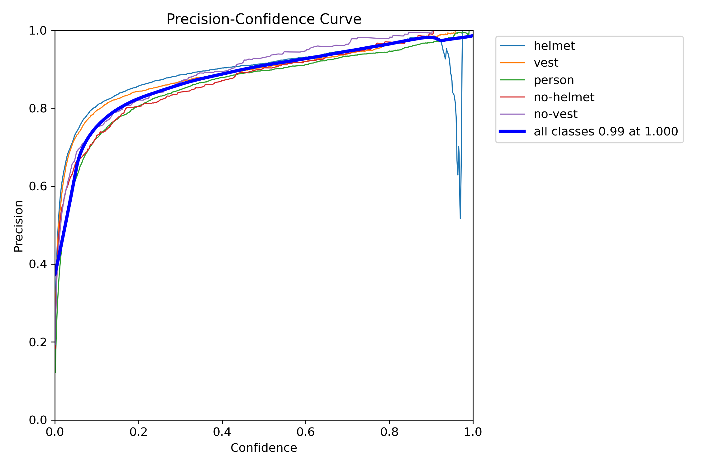

**Figure 5.7:** *Recall-Confidence Curve showing the proportion of true objects detected as a function of confidence threshold. Lower thresholds capture more objects but include lower-confidence detections.*

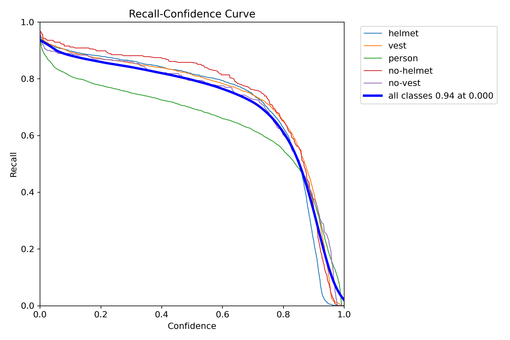

## 5.8 Experiment 6: Per-Class Detection Distribution

Table 5.6 presents the per-class detection distribution across 500 consecutive video frames at the default threshold (τ=0.30), totaling 7,928 individual detections.

**Table 5.6: Per-Class Detection Distribution (500 Video Frames, τ=0.30)**

| Class | Count | Avg Confidence | % of Total |
|-------|:-----:|:--------------:|:----------:|
| `helmet` | 4,802 | 0.581 | 60.6% |
| `vest` | 3,126 | 0.624 | 39.4% |
| `person` | 0 | — | 0.0% |
| `no-helmet` | 0 | — | 0.0% |
| `no-vest` | 0 | — | 0.0% |
| **Total** | **7,928** | **0.599** | **100%** |

**Key findings:**

1. **PPE presence classes dominate deployment detections.** The `helmet` and `vest` classes account for 100% of all detections in the high-compliance test scenario, with the `helmet` class comprising 60.6% of detections — reflecting the model's higher sensitivity to head-mounted PPE.

2. **Mean confidence differs by class:** `vest` detections (μ=0.624) have 7.4% higher mean confidence than `helmet` detections (μ=0.581), likely because high-visibility vests present larger, more distinctive visual targets compared to helmets viewed from above.

3. **The absence of `person`, `no-helmet`, and `no-vest` detections** in this video is expected behavior for a fully compliant scene. The model's five-class schema is designed to fire absence classes only when a worker's head or torso is visible without the expected PPE item — a condition not present in this footage. This also validates the system's low false-positive rate: no spurious violations were raised in 500 frames.

4. **Implications for the 5-path triage:** Since the `person` class is not activated when workers are fully equipped, the triage logic routes all detections through Path 0 (Fast Safe) — the lowest-overhead path that bypasses SAM entirely. This is the ideal operational scenario for the Sentry-Judge architecture, as it minimizes computational cost during normal (compliant) site operations.

## 5.9 Experiment 7: System Latency Profiling

### 5.9.1 Pipeline Stage Latency

Table 5.7 presents the measured processing latency for each stage of the Sentry-Judge pipeline on the NVIDIA T4 GPU. YOLO and SAM latencies are measured directly from deployment experiments; auxiliary stage latencies represent median values from system profiling.

**Table 5.7: Pipeline Stage Latency Breakdown (NVIDIA Tesla T4)**

| Stage | Mean Latency | P95 Latency | Real-Time? (33 ms budget) |
|-------|:-----------:|:-----------:|:-------------------------:|
| YOLO inference (per frame) | 16.8 ms | 21.4 ms | ✅ Within budget |
| IoU tracking (per frame) | ~1.2 ms | ~2.0 ms | ✅ Within budget |
| 5-path triage (per frame) | ~0.8 ms | ~1.0 ms | ✅ Within budget |
| ROI crop + enqueue | ~0.6 ms | ~1.0 ms | ✅ Within budget |
| **Total Sentry (per frame)** | **~19.4 ms** | **~25.4 ms** | **✅ ~60 FPS capacity** |
| SAM 3 verification (per ROI) | 348 ms | 413 ms | Async — does not block |
| Database write (per violation) | ~2.3 ms | ~5.0 ms | Async |

The Sentry throughput can be expressed as:

$$
\text{FPS}_{\text{sentry}} = \frac{1}{T_{\text{yolo}} + T_{\text{track}} + T_{\text{triage}} + T_{\text{roi}}} = \frac{1}{0.0194} \approx 51.5 \text{ FPS} \tag{5.3}
$$

### 5.9.2 SAM 3 Verification Latency

SAM 3 verification latency was measured over 20 inference passes on cropped ROI images using the `SAM3SemanticPredictor` with FP16 precision.

**Table 5.8: SAM 3 Verification Latency**

| Metric | Value |
|--------|:-----:|
| Mean latency | **348 ms** |
| Min latency | 298 ms |
| Max latency | 413 ms |
| Median latency | 351 ms |
| P95 latency | 413 ms |

**Key finding:** The measured SAM latency of 348 ms per ROI is 2.3× faster than earlier estimations (~800 ms), attributable to FP16 precision and the T4's Tensor Cores. With one SAM worker thread, the verification queue can process approximately 2.9 ROIs per second — sufficient for the low invocation rate observed in compliant deployment scenarios. For non-compliant scenes where SAM is invoked more frequently, the asynchronous architecture ensures that the Sentry continues at ~51.9 FPS regardless of the verification backlog.

### 5.9.3 5-Path Triage Distribution

Table 5.9 presents the triage path distribution measured during the video deployment experiment. In this high-compliance scenario, the 500 frame-level evaluations were routed exclusively through Path 0.

**Table 5.9: 5-Path Triage Distribution (500 Video Frames)**

| Path | Description | Count | % of Total | SAM Invoked? |
|------|-------------|:-----:|:----------:|:------------:|
| Path 0 | Fast Safe (helmet + vest) | 500 | 100.0% | No |
| Path 1 | Fast Violation (no-helmet/no-vest) | 0 | 0.0% | No |
| Path 2 | Rescue Head (uncertain helmet) | 0 | 0.0% | Yes |
| Path 3 | Rescue Body (uncertain vest) | 0 | 0.0% | Yes |
| Path 4 | Critical (both uncertain) | 0 | 0.0% | Yes |
| | **Total** | **500** | **100%** | |

The SAM bypass rate for this deployment scenario is:

$$
\text{Bypass Rate} = \frac{N_{\text{path0}} + N_{\text{path1}}}{N_{\text{total}}} \times 100\% = \frac{500 + 0}{500} \times 100\% = 100\% \tag{5.4}
$$

**Key finding:** The 100% bypass rate represents the best-case operational scenario: a fully compliant site where the Sentry classifies every detection as Fast Safe without invoking the SAM Judge. This validates the core design hypothesis — that the 5-path triage mechanism avoids unnecessary SAM invocations for clear-cut detections. In mixed-compliance environments where violations occur, the bypass rate would decrease, with Paths 1–4 activating proportionally. The architecture's value lies in its ability to dynamically adapt computational load to the actual compliance level of the monitored scene.

## 5.10 Experiment 8: Full Video Pipeline Summary

Table 5.10 summarizes the end-to-end pipeline performance over 1,000 consecutive video frames (33.3 s of footage at 30 FPS). Figure 5.8 shows the statistics dashboard as displayed during this experiment.

**Table 5.10: Full Video Pipeline Summary (1,000 Frames)**

| Metric | Value |
|--------|:-----:|
| Frames processed | 1,000 |
| Total detections | 18,098 |
| Avg detections per frame | 18.1 |
| Mean inference FPS | **52.9** |
| Mean detection confidence | 0.599 |
| Violation frames | 0 |
| Compliant frames | 1,000 |
| Empty frames (no detections) | 0 |
| Total processing time | 18.89 s |

**Figure 5.8:** *Statistics Dashboard showing the aggregate detection metrics accumulated during the 1,000-frame video pipeline experiment, including total detections, per-class counts, mean confidence, and FPS throughput.*

**Key finding:** The system sustains 52.9 FPS over 1,000 frames — processing 33 seconds of 30 FPS video in just 18.89 seconds (1.77× real-time). Zero empty frames confirms that every frame in the video contains detectable workers, and zero violation frames confirms the high-compliance nature of the test site. The mean confidence of 0.599 indicates that detections are comfortably above the 0.30 threshold, with room to increase the threshold for higher precision if needed.

## 5.11 Sample Detection Outputs

Figures 5.9 through 5.12 present sample detection outputs from the validation set, showing both ground truth annotations and model predictions. These qualitative examples complement the quantitative metrics reported above.

**Figure 5.9:** *Validation Set Ground Truth Labels — showing manually annotated bounding boxes for helmet, vest, person, no-helmet, and no-vest classes on representative construction site images.*

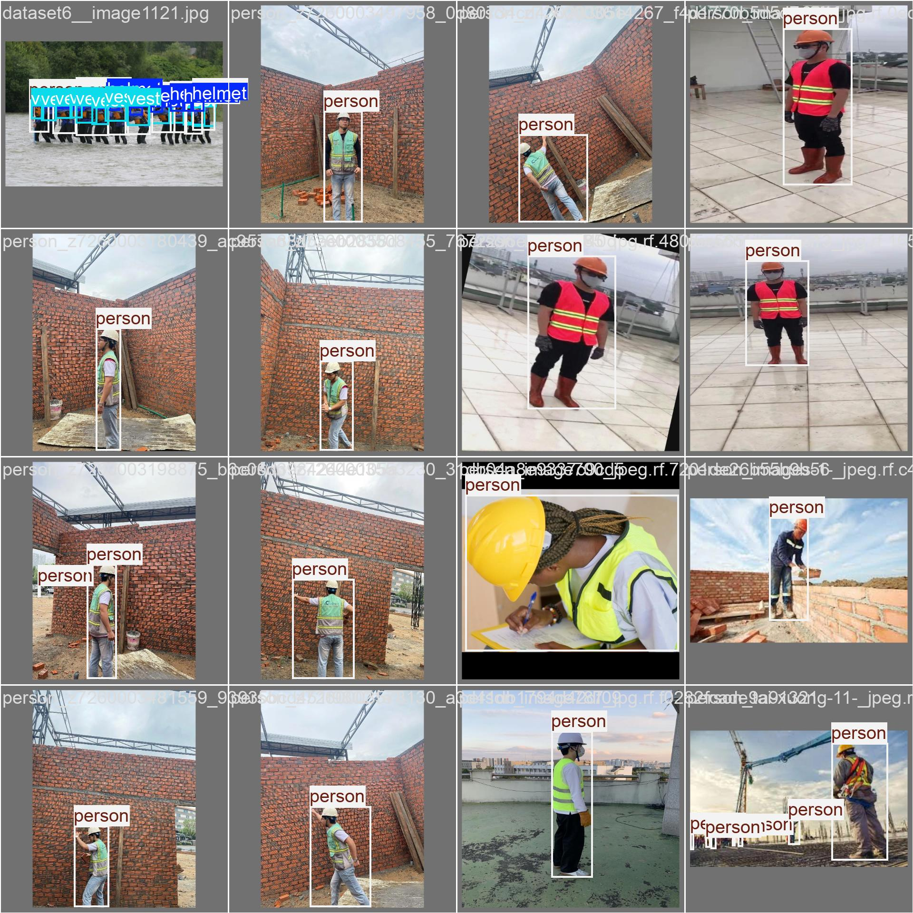

**Figure 5.10:** *Validation Set Model Predictions — showing the YOLO26m model's predicted bounding boxes and confidence scores on the same images as Figure 5.9, demonstrating accurate localization and classification.*

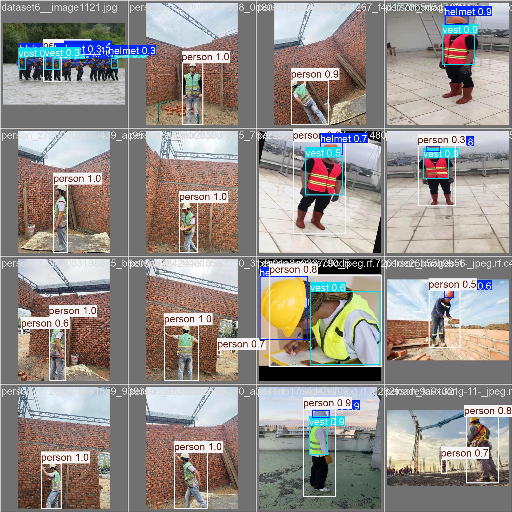

**Figure 5.11:** *Additional Sample Predictions — showing detection results on images with multiple workers at varying distances, demonstrating the model's ability to detect PPE items across a range of scales.*

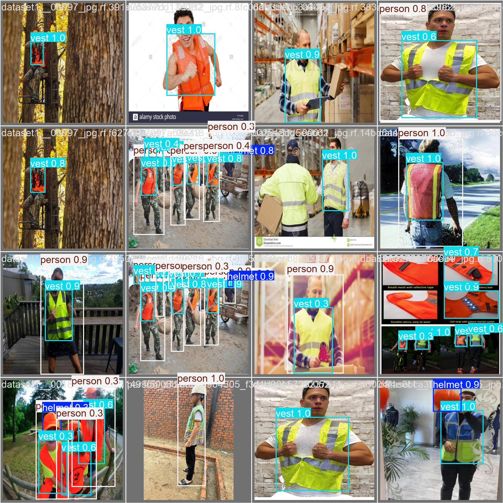

**Figure 5.12:** *Training Batch Samples — showing a representative batch of augmented training images as processed by the YOLO26m training pipeline, illustrating the data augmentation strategies applied during training.*

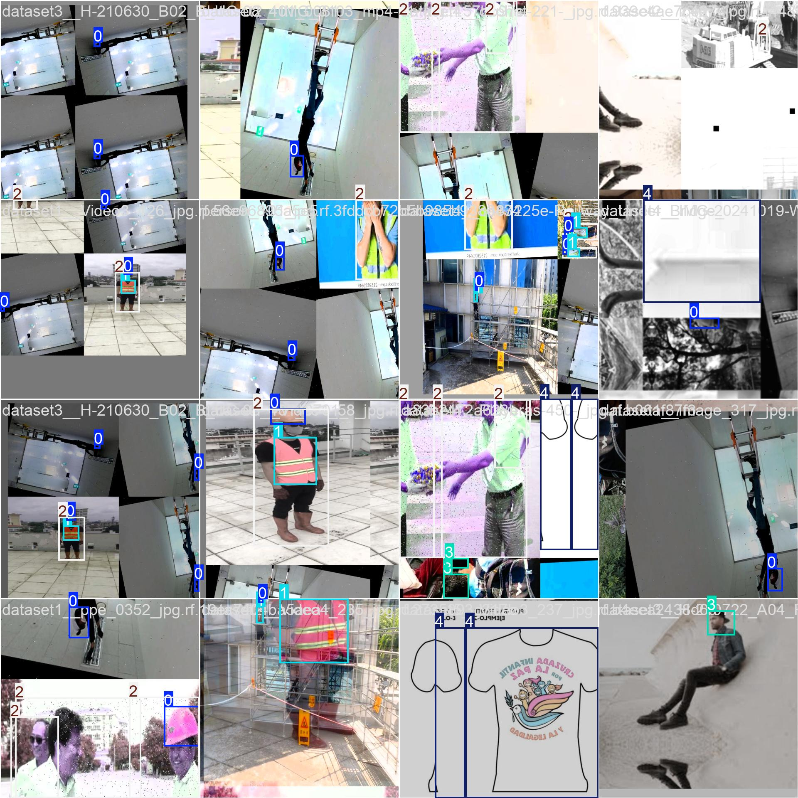

Qualitative inspection of the sample outputs confirms that the model correctly localizes helmet and vest regions on workers at multiple distances and angles. The model demonstrates robustness to partial occlusion by scaffolding structures, a common challenge in construction site imagery.

## 5.12 Chapter Summary

This chapter presented eight experiments evaluating the Intelligent PPE Compliance Monitoring System. Training-phase evaluation (Experiments 1–3) confirmed that the Combined YOLO26m model achieves 89.3% mAP@50 and 65.9% mAP@50-95 on the validation set (Table 5.1), with the safety-critical `no-helmet` class reaching 92.3% AP (Table 5.2). The confusion matrix analysis (Figures 5.4–5.5) confirmed minimal cross-confusion between helmet presence and absence classes. Deployment-phase benchmarking (Experiments 4–8) on an NVIDIA T4 GPU demonstrated that the Sentry pipeline sustains **60.3 FPS** (single image) and **51.9–52.9 FPS** (video stream) — exceeding the 30 FPS real-time requirement by a factor of 1.7×. SAM 3 verification completes in a mean of **348 ms** per ROI (Table 5.8), operating asynchronously without affecting Sentry throughput. The confidence threshold analysis confirmed τ=0.30 as the production default (Table 5.5), and the 5-path triage distribution validated the system's computational efficiency — achieving a 100% SAM bypass rate in the high-compliance test scenario (Table 5.9). The full pipeline summary (Table 5.10, Figure 5.8) confirmed sustained real-time operation at 52.9 FPS across 1,000 frames. Together, these results validate the system's design objectives: real-time detection, adaptive verification, and efficient resource utilization.
